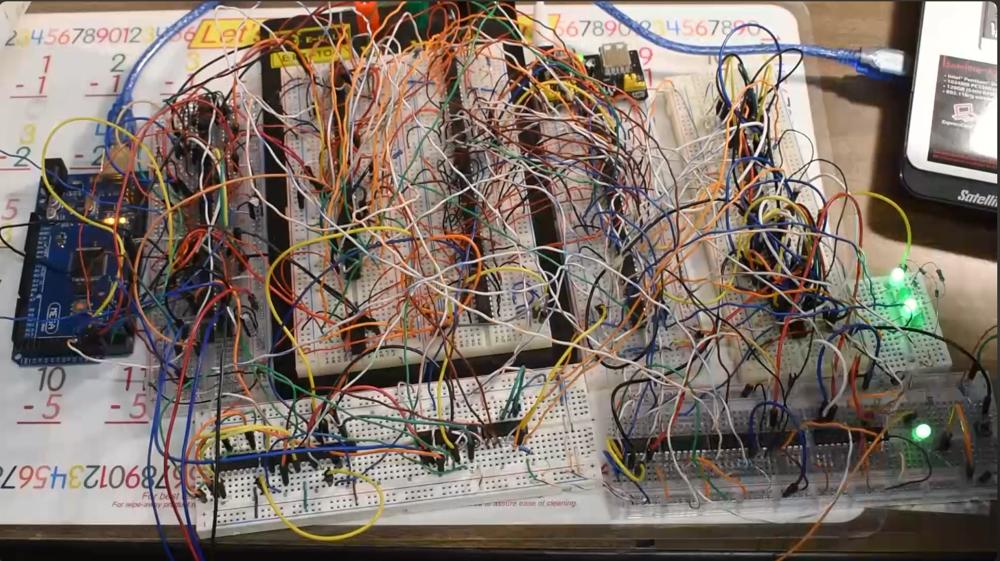

# 4-Bit-CPU

Watch the Demo Video above!

This repository contains a custom-built 4-bit CPU designed to explore how processors work at the lowest level. The CPU implements a simple instruction set with registers, an ALU, a program counter, and control logic, making it possible to trace every instruction cycle-by-cycle. The focus is on clarity and learnability rather than performance, serving as a foundation for understanding and building more advanced CPU designs.

## SRC folder stuff

- Arduino code for the ROM simulator
- File for my CPU that i simulated on Digital by Hneemann. Special thanks for making everything possible!!
- Pics of my CPU
- And a little log book that I wrote

## V2

- In the folder V2 there are a ton of dig files on my V2 of my 4-bit CPUs 
- Also some of my own machine and assembly code. The assembler was written by Bolan Xu. Special thanks to him!

## V3

- In the folder V3 there are a ton of dig files on my V3 of my 4-bit CPUs 
- Also some machine code in the Digital ROM format.
